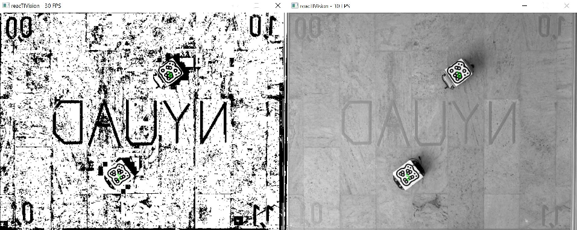

# Development
## Planning
Our first step was to break down the project into discrete deliverabes. We hopped to plan the project such that each week would drive us closer to the finished product, in a timely manner. We broke down the overall project into smaller tasks and dstributed them across the 5 weeks. The Gant Chart below illustrates our inital plan.

However, after week one, it became clear that we could finish this project in one hearty sprint--so we did. After two days of little sleep and non-stop work, we accomplished all three challenges of the assignment. A for effort in planning, not so good at staying on schedule.

## Platform Modification
### Communication
The robot, as initially given to us, came pre-configured for manual control from a base station GUI. The robot creates a Wi-Fi hotspot that the base station computer connects to. The GUI sends command packets over TCP to the robot to execute them. Unfortunately, the system came with little support and no usable API. Thus, our first step was to strip away all abstraction from the system.

The onboard Linux computer responsible for creating the access point was removed, and communication was accomplished with an XBee module, connected directly to the rover's Arduino. The Arduino's code was replaced with a simple program that reads bytes from the XBee and interprets them to directly control the motors through the motor shield. The base computer communicates with its XBee module over serial, meaning a variety of languages could be used for the main control algorithms. Initially, we planned on using Matlab, but ultimately used Python.

The new system is low-level when compared to the original one, giving more control of functionality and timing. Using the new approach, we also understand the code end-to-end and no longer have to deal with 'black boxes' when debugging.

### Hardware
The rover was originally build with 4 wheels and controlled like a tread vehicle. The overall system was inconsistent during turns, affected by slipping due to the nature of this type of turning mechanism as well poor friction between the wheels and the slippery floor.

In order to improve physical control of the vehicle, the two front wheels were removed and replaced with a single wheel on a caster. The back wheels were replaced with higher friction wheels. This system resulted in almost no slippage. Additionally, a mast was added to mount the IMU+Mag. Using LEGO Technic pieces, the sensor system was mounter 30 cm above the vehicle platform in order to limit motor EM waves from interfering with the Magnetometer.

### Attitude Heading Reference Systems (AHRS)
In order to control rover, we wanted to use an on-board IMU+Magnetonometer to create an AHRS to assist in navigation. We believed that this, alongside the machine vision tracking system to yield the best results. We hoped to combine the data using a Kalman Filter.

 AHRS algorithms are extremely complex. In order to speed up development, a [library](http://x-io.co.uk/open-source-imu-and-ahrs-algorithms/) by Sebastian Madgwick was used. The Matlab implementation offered the quickest path to testing. In order to assist visualization, GUI was written in matlab to show orientation in space based on the AHRS calculations. The GIF below shows how the GUI works, using test data provided by Madgwick:

Initially, the GY-85 sensor was used. This board is 9 degree of freedom IMU, with Magnetometers on-board. However, the acceleration values were not right, not providing an accurate gravity vector when in standstill. After little success with this sensor, we switched to the [Grove - IMU 10DOF](http://wiki.seeedstudio.com/Grove-IMU_10DOF/). This sensor, with accessible example code allowed us to quickly test AHRS with real data. Unfortunately, the overall system was too sensitive to nearby metal objects and interference from the DC motors. After several hours, the painful decision was made to abandon IMU approach.

### Machine Vision Tracking System
In order to get the position of the rover and its target, a machine vision software was used. Initially, the setup and software was to be provided, but we needed access to the setup before it was ready. As a result, we turned to a software previously used: reacTIVsion. This software identifies and tracks fiducial markers, reporting both their xy position (normalized) as well as their orientation. In our setup, we were limited by the over head camera frame-rate at 30 FPS. The machine vision software dumps its data on a TUIO port, where we could read it using pytuio, a Python library.

# Installation

#### Software

The Arduino Robot project relies on several programs and packages to function, so to begin its use, make sure you have installed the following on the main computer:

* reacTIVision
* numpy python package
* pytuio python library

# Final Software Architecture Description

#### Controller

### Navigator

### Tracker

#### XBee

The XBee is configured to operate in the 2.4 GHz frequency. They have to be preconfigured, where they are given a personal area network ID, a MY address, and a destination address.

XBee Serial communication has theoretical data rates of 250 kbit/s, which means that one byte is transmitted every 2.5 milliseconds. This is great for our purposes, since the method through which the arduino drives the rover requies between two to five bytes to move. This means that we could send between 50 to 125 instructions per second, which is enough for the rover movement system.

However, this is impaired by the reacTIVision tracking camera, since information is relayed at the camera frame rate of 30 fps. While data can be sent continuously to the rover, the target fiducial marker might have moved in between frames. 

Taking into account the XBee data rate and the camera frame rate, we can theoretically send 8 bytes per frame of information that comes in to the main computer to be processed. This means there can be between one to four instructions sent per frame.

While the reactiVISion will update at that speed, the XBee communication is constant and will sent instructions based on the most recent tracking information. However, the updates are frequent enough to ensure smooth tracking of both our rover and of potential targets.

### Robot Movement

The arduino on the rover is to be controlled by the robotMovement file. The setup begins by initializing the motor pins, and has defined motor movements. We created our own communication protocol to drive the rover, there being six possible instructions reserved on the first six integers.

|Byte Value Sent|Arduino Command|
|0x0|Motor stop|
|0x1|Turn right command; wait for next byte which will be turn speed|
|0x2|Turn left command; wait for next byte which will be turn speed|
|0x3|Move forward command; wait for next four bytes to begin movement|
|0x4|Move forward prelimiter|
|0x5|Move forward postlimiter|

The commands are sent frequent enough where if a data error occured, it should be amended quick enough by the next command. The left and right turns work by sending a turn command first, and a turn speed as the next byte. 

The forward command is more complicated. First, let the rover know you want to move forward. Then, the prelimiter is sent to the rover to make it know data will be sent. The next two bytes are supposed to be the left wheel turn speed and right wheel turn speed respectively. Then, the postlimiter is sent, telling the rover control that both speed values have been sent. If all has gone correctly, and no other command has been sent, the forward operation can proceed. Having the prelimiter and postlimiter allows for some error correction on forward movement, with the intent that wheels get their intended speed, and if some data is lost, the rover will discard all previously received data.

# User Manual

There are three modes available for the user: 
* A to B
* A to B with a turn
* Chase

#### A to B (main_a_to_b.py)

This mode will make the rover move from its original position to the given position. The main function is able to take a 'position' argument, and accepts two float values between 0 and 1. These values are based on the reacTIVision position values returned from the camera. 

The position argument specifies the user will provide an x and a y value for heading. If the program is run without arguments, the rover will default to a center position on the arena.

As an example, in mainComputerControl, use `python main_a_to_b.py -p 0.2. 0.2`

#### A to B with Heading (main_a_to_b_heading.py)

This mode is similar to the previous one, with the exception that it allows for the user to input a heading for the rover to turn to once it has reached its destination. 

The values for position are the same as before, and heading can accept a value between 1 and 359 degrees. The heading starts from the positive y direction, and goes counter-clockwise. If the program is run with no arguments, the rover will default to a center position with a heading of 0 degrees.

As an example, in mainComputerControl, use `python main_a_to_b.py -p 0.8. 0.4 -h 90`

#### Chase (main_chase.py)

The last mode is the autonomous mode, where the rover tracks a separate rover/target using a fidicual marker and chases its location. The rover will continously drive towards the marker, until it is at the exact location, at which point tracking will be on hold until the target location changes again.

# Action Shots

#### Chasing Videos
  

